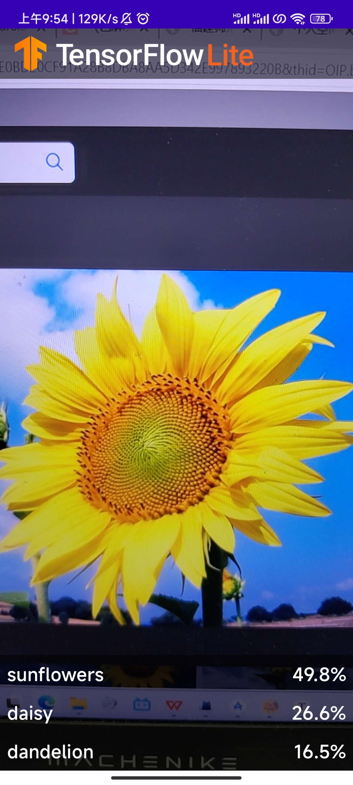

# 实验5 **实现智能图像分类APP**

## 1.安装好Android Studio 4.1以上的版本

## 2.**下载代码编译运行**

从https://github.com/hoitab/TFLClassify中下载好代码文件，并且编译运行并解决生成项目中的错误。

## 3.**实现框架中的TODO代码项**

### 3.1 复制tflite模型

在start的main文件下创建ml文件夹

将finish下的ml文件夹中的tflite文件复制到start下的ml中

同时在start下的build.gradle添加并重新同步

```
buildFeatures{
    dataBinding = true
    mlModelBinding true
}
```

### 3.2添加并初始化一个 TensorFlow Lite 模型

在TODO1下方添加代码

```kotlin
private val flowerModel: FlowerModel by lazy{
   // Initialize the Flower Model
            FlowerModel.newInstance(ctx, options)
        }
```

引入模型（例如使用 Model.newInstance(context)）。

定义一个成员变量来持有模型对象。

### 3.3 将 `ImageProxy` 转换为 `Bitmap`，然后转换为 `TensorImage`。

在TODO2下方添加代码

```kotlin
// TODO 2: Convert Image to Bitmap then to TensorImage
val tfImage = TensorImage.fromBitmap(toBitmap(imageProxy))
```

### 3.4 使用模型处理 `TensorImage` 输入，获取预测结果。

在TODO3下方添加代码

```kotlin
val outputs = flowerModel.process(tfImage)
    .probabilityAsCategoryList.apply {
        sortByDescending { it.score } // Sort with highest confidence first
    }.take(MAX_RESULT_DISPLAY) // take the top results
```

### 3.5 把模型返回的 `Category` 或 `Label` 列表转成你的 `Recognition` 类的对象列表。

在TODO4下方添加代码

```kotlin
for (output in outputs) {
    items.add(Recognition(output.label, output.score))
}
```

### 3.6 添加GPU加速依赖

在build.gradle下TODO5添加以下内容：

```xml
// TODO 5: Optional GPU Delegates
    implementation 'org.tensorflow:tensorflow-lite-gpu:2.3.0'
```

### 3.7 （可选）使用 GPU 加速模型推理。

在TODO6中添加代码

```kotlin
val compatList = CompatibilityList()

val options = if(compatList.isDelegateSupportedOnThisDevice) {
    Log.d(TAG, "This device is GPU Compatible ")
    Model.Options.Builder().setDevice(Model.Device.GPU).build()
} else {
    Log.d(TAG, "This device is GPU Incompatible ")
    Model.Options.Builder().setNumThreads(4).build()
}

// Initialize the Flower Model
FlowerModel.newInstance(ctx, options)
```

### 3.8 最后我们通过连接真机进行调试，对网上图片进行识别操作

